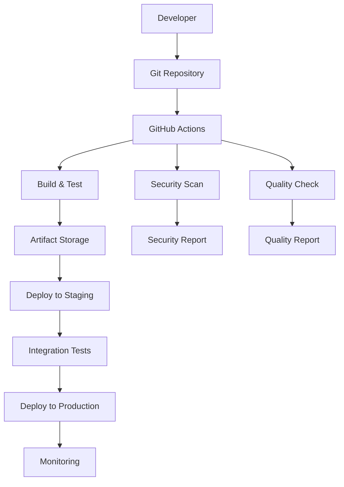

# 包括的CI/CD統合デザイン文書

## 概要

Company Backend プロジェクトの必要最小限で効率的なCI/CD統合システムを設計する。過剰な処理を避け、品質保証に焦点を当てた実用的なアプローチを採用する。

## アーキテクチャ

### システム全体構成



### CI/CDパイプライン設計

#### 1. プルリクエスト時（軽量チェック）
```yaml
# 実行時間目標: 5-8分
- コードフォーマットチェック
- 単体テスト実行
- 基本セキュリティスキャン
- 静的コード解析（基本）
```

#### 2. メインブランチマージ時（完全チェック）
```yaml
# 実行時間目標: 12-15分
- 全テストスイート実行
- 統合テスト
- セキュリティテスト完全実行
- 品質ゲートチェック
- アーティファクト生成
- ステージング環境デプロイ
```

#### 3. 本番デプロイ（手動承認）
```yaml
# 実行時間目標: 3-5分
- 手動承認プロセス
- 本番環境デプロイ
- ヘルスチェック
- 監視アラート設定
```

## コンポーネントと インターフェース

### 1. GitHub Actions ワークフロー

#### メインワークフロー: `.github/workflows/ci-cd.yml`
```yaml
name: CI/CD Pipeline
on:
  push:
    branches: [ main ]
  pull_request:
    branches: [ main ]

jobs:
  # 軽量チェック（PR時）
  quick-check:
    if: github.event_name == 'pull_request'
    
  # 完全チェック（メインブランチ）
  full-pipeline:
    if: github.ref == 'refs/heads/main'
    
  # デプロイメント
  deploy:
    if: github.ref == 'refs/heads/main'
    needs: full-pipeline
```

#### セキュリティワークフロー: `.github/workflows/security.yml`
```yaml
name: Security Scan
on:
  schedule:
    - cron: '0 2 * * 1'  # 週次実行
  workflow_dispatch:
```

### 2. ビルドとテスト設定

#### Maven設定拡張
```xml
<profiles>
  <profile>
    <id>ci</id>
    <!-- CI環境用最適化設定 -->
  </profile>
  <profile>
    <id>security</id>
    <!-- セキュリティテスト用設定 -->
  </profile>
</profiles>
```

#### テスト実行戦略
```java
// 並列テスト実行設定
@TestMethodOrder(OrderAnnotation.class)
@ExtendWith(SpringExtension.class)
public class IntegrationTestSuite {
    // 統合テスト実装
}
```

### 3. 品質ゲート設定

#### SonarQube品質ゲート
```yaml
Quality Gate:
  - Code Coverage: > 70%
  - Duplicated Lines: < 3%
  - Maintainability Rating: A
  - Reliability Rating: A
  - Security Rating: A
```

#### セキュリティ閾値
```yaml
Security Thresholds:
  - OWASP Dependency Check: CVSS < 7.0
  - SpotBugs Security: 0 High Priority Issues
  - SAST Scan: 0 Critical Issues
```

### 4. デプロイメント戦略

#### 環境構成
```yaml
Environments:
  development:
    auto_deploy: true
    approval_required: false
    
  staging:
    auto_deploy: true
    approval_required: false
    smoke_tests: true
    
  production:
    auto_deploy: false
    approval_required: true
    blue_green_deployment: true
    rollback_enabled: true
```

## データモデル

### 1. パイプライン実行結果
```java
@Entity
public class PipelineExecution {
    private String id;
    private String branch;
    private String commitSha;
    private PipelineStatus status;
    private LocalDateTime startTime;
    private LocalDateTime endTime;
    private List<TestResult> testResults;
    private SecurityScanResult securityResult;
    private QualityGateResult qualityResult;
}
```

### 2. デプロイメント履歴
```java
@Entity
public class DeploymentHistory {
    private String id;
    private String environment;
    private String version;
    private DeploymentStatus status;
    private String deployedBy;
    private LocalDateTime deploymentTime;
    private String rollbackVersion;
}
```

### 3. 品質メトリクス
```java
@Entity
public class QualityMetrics {
    private String id;
    private String projectVersion;
    private Double codeCoverage;
    private Integer codeSmells;
    private Integer bugs;
    private Integer vulnerabilities;
    private String qualityGateStatus;
    private LocalDateTime measuredAt;
}
```

## エラーハンドリング

### 1. ビルド失敗時の対応
```yaml
Build Failure Handling:
  - 即座にSlack通知
  - 失敗ログの自動収集
  - 関連開発者への通知
  - 再実行可能な状態維持
```

### 2. テスト失敗時の対応
```yaml
Test Failure Handling:
  - 詳細なテストレポート生成
  - 失敗したテストケースの特定
  - 過去の成功実行との比較
  - 自動的なissue作成（重要な場合）
```

### 3. デプロイ失敗時の対応
```yaml
Deployment Failure Handling:
  - 自動ロールバック実行
  - 緊急通知送信
  - ヘルスチェック実行
  - 障害レポート生成
```

### 4. セキュリティ問題検出時の対応
```yaml
Security Issue Handling:
  - 重要度に応じた通知レベル設定
  - 自動的なPRブロック
  - セキュリティチームへの通知
  - 修正ガイダンスの提供
```

## テスト戦略

### 1. テスト実行レベル

#### レベル1: 高速チェック（PR時）
```yaml
Duration: 3-5分
Tests:
  - Unit Tests (重要なもののみ)
  - Lint/Format Check
  - Basic Security Scan
  - Compilation Check
```

#### レベル2: 完全テスト（メインブランチ）
```yaml
Duration: 10-15分
Tests:
  - All Unit Tests
  - Integration Tests
  - Security Test Suite
  - Performance Tests (基本)
  - API Tests
```

#### レベル3: 包括テスト（週次）
```yaml
Duration: 30-45分
Tests:
  - End-to-End Tests
  - Load Testing
  - Security Penetration Tests
  - Dependency Vulnerability Scan
  - Code Quality Deep Analysis
```

### 2. テスト並列化戦略
```yaml
Parallel Execution:
  - Unit Tests: 4並列
  - Integration Tests: 2並列
  - Security Tests: 独立実行
  - Database Tests: 分離実行
```

### 3. テストデータ管理
```yaml
Test Data Strategy:
  - Testcontainers for Database
  - Mock External Services
  - Test Data Fixtures
  - Cleanup After Tests
```

## 監視とログ

### 1. パイプライン監視
```yaml
Pipeline Monitoring:
  - 実行時間トラッキング
  - 成功率メトリクス
  - 失敗パターン分析
  - リソース使用量監視
```

### 2. アプリケーション監視
```yaml
Application Monitoring:
  - Health Check Endpoints
  - Metrics Collection (Micrometer)
  - Log Aggregation
  - Error Tracking
```

### 3. セキュリティ監視
```yaml
Security Monitoring:
  - Security Event Logging
  - Vulnerability Tracking
  - Compliance Status
  - Security Metrics Dashboard
```

## 通知システム

### 1. 通知チャネル設定
```yaml
Notification Channels:
  slack:
    - channel: "#ci-cd-alerts"
    - events: [build_failure, deploy_success, security_alert]
  
  email:
    - recipients: ["team-lead@company.com"]
    - events: [production_deploy, critical_security]
  
  github:
    - pr_comments: true
    - status_checks: true
```

### 2. 通知レベル
```yaml
Notification Levels:
  INFO: 正常な完了通知
  WARNING: 品質ゲート警告
  ERROR: ビルド・テスト失敗
  CRITICAL: セキュリティ問題・本番障害
```

## セキュリティ考慮事項

### 1. シークレット管理
```yaml
Secret Management:
  - GitHub Secrets for API Keys
  - Environment-specific secrets
  - Rotation policy implementation
  - Access control and auditing
```

### 2. アクセス制御
```yaml
Access Control:
  - Branch protection rules
  - Required reviews for production
  - Deployment approval workflow
  - Audit logging
```

### 3. セキュリティスキャン統合
```yaml
Security Scanning:
  - SAST: SonarQube Security Rules
  - DAST: OWASP ZAP (基本)
  - Dependency Check: OWASP Dependency Check
  - Container Scan: Docker Scout
```

## パフォーマンス最適化

### 1. ビルド最適化
```yaml
Build Optimization:
  - Maven Dependency Caching
  - Docker Layer Caching
  - Parallel Build Execution
  - Incremental Compilation
```

### 2. テスト最適化
```yaml
Test Optimization:
  - Test Selection (変更されたコードのみ)
  - Parallel Test Execution
  - Test Result Caching
  - Fast Feedback Loop
```

### 3. デプロイ最適化
```yaml
Deployment Optimization:
  - Blue-Green Deployment
  - Rolling Updates
  - Health Check Integration
  - Automated Rollback
```

## 実装優先順位

### フェーズ1: 基本CI/CD（1-2週間）
1. GitHub Actions基本ワークフロー
2. ビルドとテスト自動化
3. 基本的な通知システム
4. 品質ゲート設定

### フェーズ2: セキュリティ統合（1週間）
1. セキュリティスキャン統合
2. 脆弱性チェック自動化
3. セキュリティレポート生成
4. セキュリティ通知システム

### フェーズ3: デプロイ自動化（1週間）
1. ステージング環境自動デプロイ
2. 本番デプロイワークフロー
3. ロールバック機能
4. 監視とアラート

### フェーズ4: 最適化と監視（1週間）
1. パフォーマンス最適化
2. 監視ダッシュボード
3. メトリクス収集
4. レポート自動化