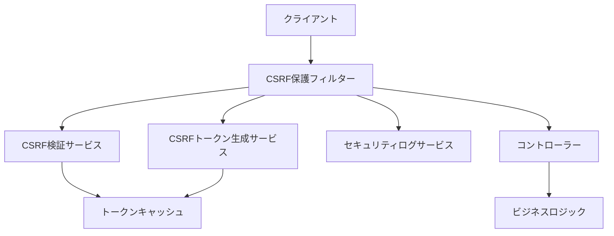

# CSRF保護強化 - 設計書

## 概要

JWT認証環境において、従来のセッションベースCSRF保護に代わる、カスタムCSRF保護メカニズムを設計・実装します。この設計は、セキュリティ強化と既存システムとの互換性を両立させることを目的としています。

## アーキテクチャ

### 全体アーキテクチャ



### セキュリティレイヤー構成

1. **フィルターレイヤー**: リクエストの最初の段階でCSRF検証を実行
2. **検証レイヤー**: Origin/Referer、CSRFトークンの検証ロジック
3. **生成レイヤー**: セキュアなCSRFトークンの生成と管理
4. **ログレイヤー**: セキュリティイベントの記録と監視

## コンポーネント設計

### 1. CSRF保護フィルター (CsrfProtectionFilter)

```java
@Component
@Order(Ordered.HIGHEST_PRECEDENCE + 10)
public class CsrfProtectionFilter implements Filter {
    
    private final CsrfTokenService csrfTokenService;
    private final CsrfValidationService csrfValidationService;
    private final SecurityEventLogger securityEventLogger;
    
    @Override
    public void doFilter(ServletRequest request, ServletResponse response, 
                        FilterChain chain) throws IOException, ServletException {
        
        HttpServletRequest httpRequest = (HttpServletRequest) request;
        HttpServletResponse httpResponse = (HttpServletResponse) response;
        
        // 1. 状態変更操作の判定
        if (isStateChangingRequest(httpRequest)) {
            
            // 2. Origin/Referer検証
            if (!csrfValidationService.validateOrigin(httpRequest)) {
                handleCsrfViolation(httpRequest, httpResponse, "Invalid Origin");
                return;
            }
            
            // 3. CSRFトークン検証
            if (!csrfValidationService.validateCsrfToken(httpRequest)) {
                handleCsrfViolation(httpRequest, httpResponse, "Invalid CSRF Token");
                return;
            }
        }
        
        // 4. CSRFトークンの生成・更新
        csrfTokenService.generateTokenIfNeeded(httpRequest, httpResponse);
        
        chain.doFilter(request, response);
    }
}
```

### 2. CSRF検証サービス (CsrfValidationService)

```java
@Service
public class CsrfValidationService {
    
    private final CsrfTokenRepository csrfTokenRepository;
    private final CsrfConfigurationProperties csrfConfig;
    
    /**
     * Origin/Refererヘッダーの検証
     */
    public boolean validateOrigin(HttpServletRequest request) {
        String origin = request.getHeader("Origin");
        String referer = request.getHeader("Referer");
        
        // Origin優先、なければRefererを使用
        String sourceOrigin = origin != null ? origin : extractOriginFromReferer(referer);
        
        if (sourceOrigin == null) {
            return false; // Origin/Refererが存在しない場合は拒否
        }
        
        return csrfConfig.getAllowedOrigins().contains(sourceOrigin);
    }
    
    /**
     * CSRFトークンの検証
     */
    public boolean validateCsrfToken(HttpServletRequest request) {
        // ヘッダーからトークンを取得
        String headerToken = request.getHeader("X-CSRF-TOKEN");
        
        // Cookieからトークンを取得
        String cookieToken = extractCsrfTokenFromCookie(request);
        
        // Double Submit Cookie パターンの検証
        if (headerToken == null || cookieToken == null) {
            return false;
        }
        
        if (!headerToken.equals(cookieToken)) {
            return false;
        }
        
        // トークンの有効性検証
        return csrfTokenRepository.isValidToken(headerToken, getUserId(request));
    }
}
```

### 3. CSRFトークン生成サービス (CsrfTokenService)

```java
@Service
public class CsrfTokenService {
    
    private final CsrfTokenRepository csrfTokenRepository;
    private final SecureRandom secureRandom;
    
    /**
     * CSRFトークンの生成
     */
    public String generateCsrfToken(String userId) {
        // セキュアなランダムトークンを生成
        byte[] tokenBytes = new byte[32];
        secureRandom.nextBytes(tokenBytes);
        String token = Base64.getUrlEncoder().withoutPadding().encodeToString(tokenBytes);
        
        // トークンをリポジトリに保存（有効期限付き）
        CsrfToken csrfToken = new CsrfToken(token, userId, 
                                           Instant.now().plus(Duration.ofHours(1)));
        csrfTokenRepository.save(csrfToken);
        
        return token;
    }
    
    /**
     * レスポンスにCSRFトークンを設定
     */
    public void setCsrfTokenInResponse(HttpServletResponse response, String token) {
        // ヘッダーに設定
        response.setHeader("X-CSRF-TOKEN", token);
        
        // Cookieに設定（Double Submit Cookie パターン）
        Cookie csrfCookie = new Cookie("CSRF-TOKEN", token);
        csrfCookie.setHttpOnly(true);
        csrfCookie.setSecure(true);
        csrfCookie.setSameSite(Cookie.SameSite.STRICT);
        csrfCookie.setPath("/");
        csrfCookie.setMaxAge(3600); // 1時間
        
        response.addCookie(csrfCookie);
    }
}
```

### 4. CSRFトークンリポジトリ (CsrfTokenRepository)

```java
@Repository
public class CsrfTokenRepository {
    
    private final RedisTemplate<String, CsrfToken> redisTemplate;
    
    /**
     * トークンの保存
     */
    public void save(CsrfToken token) {
        String key = generateKey(token.getUserId(), token.getToken());
        redisTemplate.opsForValue().set(key, token, Duration.ofHours(1));
    }
    
    /**
     * トークンの有効性確認
     */
    public boolean isValidToken(String token, String userId) {
        String key = generateKey(userId, token);
        CsrfToken storedToken = redisTemplate.opsForValue().get(key);
        
        if (storedToken == null) {
            return false;
        }
        
        // 有効期限チェック
        if (storedToken.getExpiresAt().isBefore(Instant.now())) {
            redisTemplate.delete(key);
            return false;
        }
        
        return true;
    }
    
    /**
     * 使用済みトークンの削除（ワンタイム使用の場合）
     */
    public void invalidateToken(String token, String userId) {
        String key = generateKey(userId, token);
        redisTemplate.delete(key);
    }
}
```

### 5. セキュリティイベントロガー (SecurityEventLogger)

```java
@Service
public class SecurityEventLogger {
    
    private final Logger securityLogger = LoggerFactory.getLogger("SECURITY");
    private final SecurityEventRepository securityEventRepository;
    
    /**
     * CSRF攻撃の記録
     */
    public void logCsrfViolation(HttpServletRequest request, String reason) {
        SecurityEvent event = SecurityEvent.builder()
                .eventType("CSRF_VIOLATION")
                .ipAddress(getClientIpAddress(request))
                .userAgent(request.getHeader("User-Agent"))
                .requestUri(request.getRequestURI())
                .reason(reason)
                .timestamp(Instant.now())
                .build();
        
        // データベースに記録
        securityEventRepository.save(event);
        
        // ログファイルに記録
        securityLogger.warn("CSRF violation detected: {} from IP: {} for URI: {}", 
                           reason, event.getIpAddress(), event.getRequestUri());
        
        // 閾値を超えた場合のアラート
        checkAndTriggerAlert(event.getIpAddress());
    }
}
```

## データモデル

### CsrfToken エンティティ

```java
@Entity
@Table(name = "csrf_tokens")
public class CsrfToken {
    
    @Id
    private String id;
    
    @Column(nullable = false)
    private String token;
    
    @Column(nullable = false)
    private String userId;
    
    @Column(nullable = false)
    private Instant createdAt;
    
    @Column(nullable = false)
    private Instant expiresAt;
    
    @Column
    private boolean used;
    
    // コンストラクタ、ゲッター、セッター
}
```

### SecurityEvent エンティティ

```java
@Entity
@Table(name = "security_events")
public class SecurityEvent {
    
    @Id
    @GeneratedValue(strategy = GenerationType.IDENTITY)
    private Long id;
    
    @Column(nullable = false)
    private String eventType;
    
    @Column(nullable = false)
    private String ipAddress;
    
    @Column
    private String userAgent;
    
    @Column
    private String requestUri;
    
    @Column
    private String reason;
    
    @Column(nullable = false)
    private Instant timestamp;
    
    // コンストラクタ、ゲッター、セッター
}
```

## 設定管理

### CSRF設定プロパティ

```java
@ConfigurationProperties(prefix = "app.security.csrf")
@Data
public class CsrfConfigurationProperties {
    
    /**
     * CSRF保護の有効/無効
     */
    private boolean enabled = true;
    
    /**
     * 許可されたオリジンのリスト
     */
    private List<String> allowedOrigins = Arrays.asList(
        "http://localhost:3000",
        "https://company.example.com"
    );
    
    /**
     * CSRFトークンの有効期限（秒）
     */
    private int tokenExpirationSeconds = 3600;
    
    /**
     * ワンタイム使用の有効/無効
     */
    private boolean oneTimeUse = false;
    
    /**
     * 警告モード（ログのみ、ブロックしない）
     */
    private boolean warningMode = false;
    
    /**
     * 除外パス（CSRF保護を適用しないパス）
     */
    private List<String> excludedPaths = Arrays.asList(
        "/api/auth/**",
        "/actuator/**"
    );
}
```

### application.yml 設定例

```yaml
app:
  security:
    csrf:
      enabled: true
      allowed-origins:
        - "http://localhost:3000"
        - "https://company.example.com"
      token-expiration-seconds: 3600
      one-time-use: false
      warning-mode: false
      excluded-paths:
        - "/api/auth/**"
        - "/actuator/**"

spring:
  profiles:
    active: production

---
spring:
  config:
    activate:
      on-profile: development
      
app:
  security:
    csrf:
      enabled: false
      warning-mode: true
```

## エラーハンドリング

### CSRF例外クラス

```java
public class CsrfProtectionException extends RuntimeException {
    
    private final CsrfViolationType violationType;
    private final String clientIp;
    private final String requestUri;
    
    public CsrfProtectionException(CsrfViolationType violationType, 
                                  String message, String clientIp, String requestUri) {
        super(message);
        this.violationType = violationType;
        this.clientIp = clientIp;
        this.requestUri = requestUri;
    }
    
    public enum CsrfViolationType {
        INVALID_ORIGIN,
        MISSING_TOKEN,
        INVALID_TOKEN,
        EXPIRED_TOKEN,
        TOKEN_MISMATCH
    }
}
```

### グローバル例外ハンドラー

```java
@ControllerAdvice
public class CsrfExceptionHandler {
    
    @ExceptionHandler(CsrfProtectionException.class)
    public ResponseEntity<ErrorResponse> handleCsrfProtectionException(
            CsrfProtectionException ex) {
        
        ErrorResponse errorResponse = ErrorResponse.builder()
                .error("CSRF_PROTECTION_VIOLATION")
                .message("Request blocked due to CSRF protection")
                .timestamp(Instant.now())
                .build();
        
        return ResponseEntity.status(HttpStatus.FORBIDDEN).body(errorResponse);
    }
}
```

## テスト戦略

### 単体テスト

1. **CsrfValidationServiceTest**: Origin/Referer検証ロジックのテスト
2. **CsrfTokenServiceTest**: トークン生成・検証ロジックのテスト
3. **CsrfProtectionFilterTest**: フィルターの動作テスト

### 統合テスト

1. **CsrfProtectionIntegrationTest**: エンドツーエンドのCSRF保護テスト
2. **CsrfPerformanceTest**: パフォーマンス要件の検証
3. **CsrfSecurityTest**: セキュリティ要件の包括的テスト

## パフォーマンス考慮事項

### キャッシュ戦略

1. **Redisキャッシュ**: CSRFトークンの高速アクセス
2. **TTL設定**: 自動的な期限切れトークンのクリーンアップ
3. **メモリ効率**: トークンサイズの最適化

### スケーラビリティ

1. **水平スケーリング**: Redis Clusterによる分散キャッシュ
2. **負荷分散**: 複数インスタンス間でのトークン共有
3. **監視**: メトリクスとアラートの設定

## セキュリティ考慮事項

### 脅威モデル

1. **CSRF攻撃**: 悪意のあるサイトからの状態変更リクエスト
2. **トークン盗用**: XSSによるCSRFトークンの窃取
3. **リプレイ攻撃**: 古いトークンの再利用
4. **ブルートフォース**: トークンの推測攻撃

### 対策

1. **セキュアランダム**: 暗号学的に安全な乱数生成
2. **短い有効期限**: トークンの有効期限を1時間に制限
3. **ログ監視**: 攻撃パターンの検出とアラート
4. **レート制限**: 同一IPからの過度なリクエストの制限