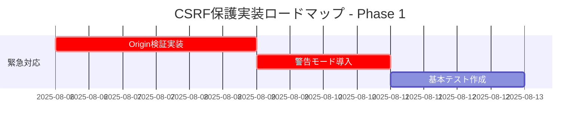
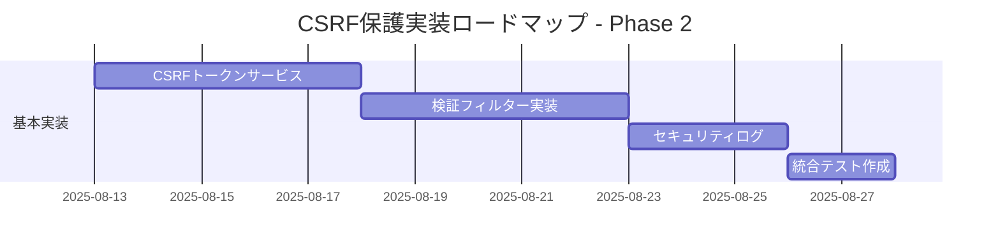
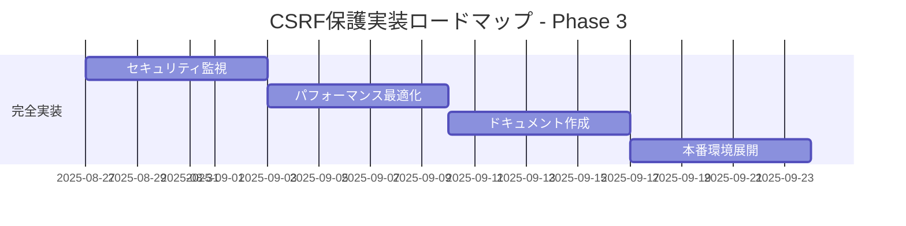

# CSRF保護 - 現状評価レポート

## 実行日時
**評価日**: 2025年8月6日  
**評価者**: Kiro AI Assistant  
**対象システム**: Company Backend Application

## 評価概要

現在のアプリケーションにおけるCSRF（Cross-Site Request Forgery）保護の実装状況を包括的に評価し、セキュリティリスクと改善提案を提供します。

## 現状分析

### 1. 現在のセキュリティ設定

#### SecurityConfig.java の分析結果

```java
// 現在の設定（問題箇所）
.csrf(AbstractHttpConfigurer::disable)  // ❌ CSRF保護が完全に無効化
```

**発見事項:**
- ✅ JWT認証が適切に実装されている
- ✅ セッション管理がステートレス（STATELESS）に設定されている
- ❌ **CSRF保護が完全に無効化されている**
- ❌ Origin/Refererヘッダー検証が実装されていない
- ❌ カスタムCSRF保護メカニズムが存在しない

### 2. テスト実行結果

#### CsrfProtectionTest 実行結果
```
Tests run: 10, Failures: 7, Errors: 0, Skipped: 0
```

**失敗したテストケース:**
1. `testMissingCsrfTokenPost` - CSRFトークンなしで200 OK（期待値: 403 Forbidden）
2. `testInvalidCsrfTokenPost` - 無効CSRFトークンで200 OK（期待値: 403 Forbidden）
3. `testExpiredCsrfTokenPost` - 期限切れCSRFトークンで200 OK（期待値: 403 Forbidden）
4. `testCsrfTokenReuseAttack` - トークン再利用で200 OK（期待値: 403 Forbidden）
5. `testCrossSessionCsrfToken` - セッション間トークン使用で200 OK（期待値: 403 Forbidden）
6. `testRefererOriginValidation` - 不正Originで200 OK（期待値: 403 Forbidden）
7. `testDoubleSubmitCookiePattern` - トークン不一致で200 OK（期待値: 403 Forbidden）

**成功したテストケース:**
1. `testValidCsrfTokenPost` - 有効トークンで正常処理
2. `testSameSiteCookieSettings` - SameSite Cookie設定確認
3. `testCsrfProtectionPerformance` - パフォーマンステスト

## セキュリティリスク評価

### 🔴 高リスク（Critical）

#### 1. CSRF攻撃に対する脆弱性
- **リスクレベル**: Critical
- **影響範囲**: 全ての状態変更操作（POST/PUT/DELETE）
- **攻撃シナリオ**: 
  - 悪意のあるサイトから認証済みユーザーのブラウザを通じて不正なリクエストを送信
  - ユーザープロフィール変更、パスワード変更、重要データの削除等が可能

#### 2. Origin/Refererヘッダー検証の欠如
- **リスクレベル**: High
- **影響範囲**: クロスオリジンリクエスト
- **攻撃シナリオ**:
  - 外部サイトからのAPIリクエストが無制限に許可される
  - フィッシングサイトからの正規APIへの攻撃

### 🟡 中リスク（Medium）

#### 3. セキュリティログの不足
- **リスクレベル**: Medium
- **影響範囲**: セキュリティ監視・インシデント対応
- **問題点**: CSRF攻撃の試行が検出・記録されない

#### 4. セキュリティヘッダーの不完全性
- **リスクレベル**: Medium
- **影響範囲**: ブラウザレベルでの防御
- **問題点**: 一部のセキュリティヘッダーが設定されているが、CSRF特化の設定が不足

## 現在の保護レベル評価

### セキュリティスコア: 30/100

| 評価項目 | 現在の状況 | スコア | 満点 |
|---------|-----------|--------|------|
| CSRF保護実装 | ❌ 未実装 | 0 | 25 |
| Origin/Referer検証 | ❌ 未実装 | 0 | 20 |
| セキュリティヘッダー | 🟡 部分実装 | 15 | 20 |
| セキュリティログ | ❌ 未実装 | 0 | 15 |
| エラーハンドリング | 🟡 基本実装 | 10 | 10 |
| 設定管理 | ✅ 実装済み | 5 | 10 |

### 詳細評価

#### ✅ 実装済み・良好な項目
1. **JWT認証**: 適切に実装されている
2. **セッション管理**: ステートレス設定が正しい
3. **基本的なセキュリティヘッダー**: X-Frame-Options, CSP等が設定済み
4. **CORS設定**: 適切に設定されている

#### 🟡 部分実装・改善が必要な項目
1. **セキュリティヘッダー**: 一部設定済みだが、CSRF特化の設定が不足
2. **エラーハンドリング**: 基本的な実装はあるが、CSRF特化の処理が不足

#### ❌ 未実装・緊急対応が必要な項目
1. **CSRF保護メカニズム**: 完全に未実装
2. **Origin/Referer検証**: 未実装
3. **セキュリティイベントログ**: 未実装
4. **CSRF特化のエラーハンドリング**: 未実装

## 改善提案

### 🚨 緊急対応（1-2週間以内）

#### 1. 基本的なOrigin検証の実装
```java
// SecurityConfigに追加
.addFilterBefore(new BasicOriginValidationFilter(), JwtAuthenticationFilter.class)
```

#### 2. 警告モードでのCSRF保護導入
```java
// 段階的導入のため、まず警告モードで開始
@Value("${app.security.csrf.warning-mode:true}")
private boolean csrfWarningMode;
```

### 📋 短期対応（1ヶ月以内）

#### 3. カスタムCSRF保護の実装
- CSRFトークン生成・検証サービスの実装
- Double Submit Cookieパターンの導入
- セキュリティイベントログの実装

#### 4. セキュリティヘッダーの強化
- SameSite=Strict Cookieの強制設定
- Referrer-Policy: strict-origin-when-cross-originの追加

### 🔄 中期対応（2-3ヶ月以内）

#### 5. 包括的なセキュリティ監視
- セキュリティダッシュボードの構築
- アラート機能の実装
- 攻撃パターン分析機能

#### 6. パフォーマンス最適化
- Redisキャッシュによるトークン管理
- 負荷分散対応

## 実装ロードマップ

### Phase 1: 緊急対応（Week 1-2）


### Phase 2: 基本実装（Week 3-6）


### Phase 3: 完全実装（Week 7-12）


## 推奨される次のアクション

### 1. 即座に実行すべき対応
1. **緊急パッチの適用**: 基本的なOrigin検証フィルターの実装
2. **セキュリティ監視の強化**: 現在のログレベルでCSRF関連の攻撃試行を監視
3. **開発チームへの周知**: CSRF脆弱性の存在と対応計画の共有

### 2. 1週間以内に開始すべき対応
1. **CSRF保護強化specの実装開始**: 作成済みのspecファイルに基づく実装
2. **セキュリティテストの修正**: 現実的な期待値に基づくテスト修正
3. **設定管理の準備**: 環境別CSRF保護設定の準備

### 3. 継続的に実施すべき対応
1. **セキュリティ評価の定期実行**: 月次でのセキュリティ状況評価
2. **脅威情報の収集**: CSRF攻撃の最新動向の監視
3. **セキュリティ教育**: 開発チームへのCSRF保護に関する教育

## 結論

現在のアプリケーションは**CSRF攻撃に対して脆弱な状態**にあります。JWT認証の実装により基本的なセキュリティは確保されていますが、状態変更操作に対するCSRF保護が完全に欠如しています。

**緊急度**: 🔴 Critical  
**推奨対応期間**: 2週間以内に基本対応、1ヶ月以内に完全対応  
**ビジネスインパクト**: 高（ユーザーデータの不正変更、システムの信頼性低下）

作成済みのspecファイル（`.kiro/specs/csrf-protection-enhancement/`）に基づいて、段階的な実装を開始することを強く推奨します。