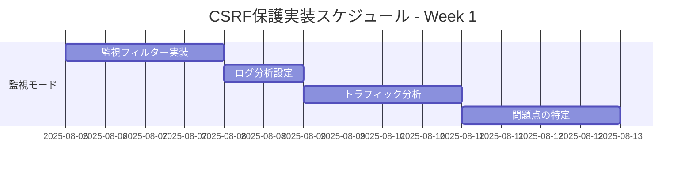
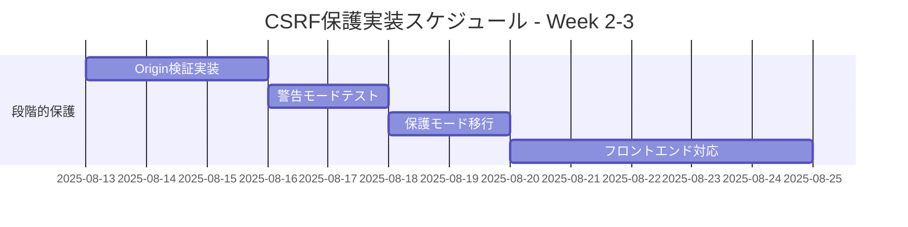
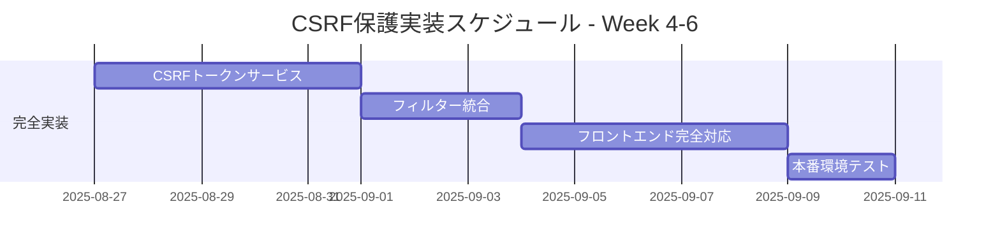

# 運営中サイトへの安全なCSRF保護実装計画

## 概要

現在運営中のサイトに対して、JWT認証に影響を与えることなく、段階的にCSRF保護を実装する安全な計画です。

## 🔒 JWT認証への影響分析

### ✅ 影響なし - 理由
1. **認証フローの独立性**: JWT認証は`Authorization`ヘッダーのみを使用
2. **フィルター分離**: JWT認証フィルターとCSRF保護フィルターは独立動作
3. **エンドポイント除外**: 認証関連エンドポイント（`/api/auth/**`）はCSRF保護対象外

### 🔍 現在の認証フロー（変更なし）
```
フロントエンド → POST /api/auth/login → JWTトークン取得
フロントエンド → Authorization: Bearer <token> → API呼び出し
```

## 📋 段階的実装計画（3フェーズ）

### Phase 1: 監視・警告モード（1週間）
**目的**: 現在のトラフィックパターンを把握し、影響を最小化

#### 実装内容
```java
@Component
@Order(Ordered.HIGHEST_PRECEDENCE + 5)
public class CsrfMonitoringFilter implements Filter {
    
    @Value("${app.security.csrf.monitoring-mode:true}")
    private boolean monitoringMode;
    
    @Override
    public void doFilter(ServletRequest request, ServletResponse response, 
                        FilterChain chain) throws IOException, ServletException {
        
        HttpServletRequest httpRequest = (HttpServletRequest) request;
        
        // 状態変更操作のみ監視
        if (isStateChangingRequest(httpRequest) && !isExcludedPath(httpRequest)) {
            
            // Origin/Refererヘッダーの存在確認（ブロックしない）
            String origin = httpRequest.getHeader("Origin");
            String referer = httpRequest.getHeader("Referer");
            
            if (origin == null && referer == null) {
                // ログのみ記録、リクエストはブロックしない
                log.warn("CSRF Monitor: Missing Origin/Referer headers for {} from IP: {}", 
                        httpRequest.getRequestURI(), getClientIp(httpRequest));
            }
        }
        
        chain.doFilter(request, response);
    }
}
```

#### 設定
```yaml
# application.yml
app:
  security:
    csrf:
      monitoring-mode: true
      excluded-paths:
        - "/api/auth/**"
        - "/actuator/**"
        - "/api/public/**"
```

### Phase 2: 段階的保護導入（2週間）
**目的**: 基本的なCSRF保護を段階的に導入

#### 2.1 Origin/Referer検証（警告モード）
```java
@Component
@ConditionalOnProperty(name = "app.security.csrf.origin-validation.enabled", havingValue = "true")
public class OriginValidationFilter implements Filter {
    
    @Value("${app.security.csrf.origin-validation.warning-mode:true}")
    private boolean warningMode;
    
    @Value("#{'${app.security.csrf.allowed-origins}'.split(',')}")
    private List<String> allowedOrigins;
    
    @Override
    public void doFilter(ServletRequest request, ServletResponse response, 
                        FilterChain chain) throws IOException, ServletException {
        
        HttpServletRequest httpRequest = (HttpServletRequest) request;
        HttpServletResponse httpResponse = (HttpServletResponse) response;
        
        if (isStateChangingRequest(httpRequest) && !isExcludedPath(httpRequest)) {
            
            if (!validateOrigin(httpRequest)) {
                if (warningMode) {
                    // 警告モード: ログのみ、リクエストは通す
                    log.warn("CSRF Warning: Invalid origin for {} from IP: {}", 
                            httpRequest.getRequestURI(), getClientIp(httpRequest));
                } else {
                    // 保護モード: リクエストをブロック
                    httpResponse.setStatus(HttpStatus.FORBIDDEN.value());
                    return;
                }
            }
        }
        
        chain.doFilter(request, response);
    }
}
```

#### 2.2 設定（段階的有効化）
```yaml
# Week 1: 監視のみ
app:
  security:
    csrf:
      origin-validation:
        enabled: true
        warning-mode: true
        allowed-origins: 
          - "http://localhost:3000"
          - "https://your-domain.com"

# Week 2: 段階的保護
app:
  security:
    csrf:
      origin-validation:
        enabled: true
        warning-mode: false  # 実際にブロック開始
```

### Phase 3: 完全なCSRF保護（3週間）
**目的**: カスタムCSRFトークンによる完全な保護

#### 3.1 CSRFトークン生成・検証
```java
@RestController
@RequestMapping("/api/csrf")
public class CsrfTokenController {
    
    private final CsrfTokenService csrfTokenService;
    
    /**
     * CSRFトークン取得エンドポイント
     * フロントエンドが必要に応じて呼び出し
     */
    @GetMapping("/token")
    public ResponseEntity<CsrfTokenResponse> getCsrfToken(HttpServletRequest request) {
        String userId = getCurrentUserId(request);
        String csrfToken = csrfTokenService.generateToken(userId);
        
        CsrfTokenResponse response = new CsrfTokenResponse(csrfToken);
        return ResponseEntity.ok(response);
    }
}
```

#### 3.2 フロントエンド対応（段階的）
```javascript
// 既存のAPIクライアント（変更なし）
const loginUser = async (credentials) => {
    const response = await fetch('/api/auth/login', {
        method: 'POST',
        headers: {
            'Content-Type': 'application/json'
        },
        body: JSON.stringify(credentials)
    });
    return response.json();
};

// 新しい状態変更操作（CSRFトークン付き）
const updateProfile = async (profileData) => {
    // CSRFトークンを取得（必要に応じて）
    const csrfToken = await getCsrfToken();
    
    const response = await fetch('/api/users/profile', {
        method: 'PUT',
        headers: {
            'Content-Type': 'application/json',
            'Authorization': `Bearer ${getJwtToken()}`,
            'X-CSRF-TOKEN': csrfToken  // 新規追加
        },
        body: JSON.stringify(profileData)
    });
    return response.json();
};
```

## 🚀 実装スケジュール

### Week 1: 監視モード導入


### Week 2-3: 段階的保護


### Week 4-6: 完全実装


## 🔧 設定管理戦略

### 環境別設定
```yaml
# application-development.yml
app:
  security:
    csrf:
      enabled: false
      monitoring-mode: true

# application-staging.yml  
app:
  security:
    csrf:
      enabled: true
      warning-mode: true
      
# application-production.yml
app:
  security:
    csrf:
      enabled: true
      warning-mode: false
```

### 動的設定変更
```java
@Component
@RefreshScope
public class CsrfConfigurationProperties {
    
    @Value("${app.security.csrf.enabled:false}")
    private boolean enabled;
    
    @Value("${app.security.csrf.warning-mode:true}")
    private boolean warningMode;
    
    // 設定の動的変更に対応
}
```

## 📊 監視・アラート設定

### メトリクス収集
```java
@Component
public class CsrfMetricsCollector {
    
    private final MeterRegistry meterRegistry;
    
    public void recordCsrfViolation(String violationType, String clientIp) {
        Counter.builder("csrf.violations")
                .tag("type", violationType)
                .tag("client_ip", clientIp)
                .register(meterRegistry)
                .increment();
    }
}
```

### アラート設定
```yaml
# Prometheus Alert Rules
groups:
  - name: csrf_protection
    rules:
      - alert: HighCSRFViolationRate
        expr: rate(csrf_violations_total[5m]) > 10
        for: 2m
        labels:
          severity: warning
        annotations:
          summary: "High CSRF violation rate detected"
```

## 🧪 テスト戦略

### 段階的テスト
1. **監視モードテスト**: ログ出力の確認
2. **警告モードテスト**: 警告ログの確認、機能への影響なし
3. **保護モードテスト**: 実際のブロック動作確認

### 回帰テスト
```java
@Test
public void testJwtAuthenticationUnaffected() {
    // JWT認証が影響を受けないことを確認
    String token = jwtTokenProvider.generateToken(testUser);
    
    mockMvc.perform(get("/api/users/profile")
            .header("Authorization", "Bearer " + token))
            .andExpect(status().isOk());
}

@Test
public void testAuthEndpointsExcluded() {
    // 認証エンドポイントがCSRF保護対象外であることを確認
    mockMvc.perform(post("/api/auth/login")
            .contentType(MediaType.APPLICATION_JSON)
            .content(loginRequestJson))
            .andExpect(status().isOk());
}
```

## 🔄 ロールバック計画

### 緊急時の設定変更
```yaml
# 緊急時: CSRF保護を無効化
app:
  security:
    csrf:
      enabled: false
      monitoring-mode: true
```

### 段階的ロールバック
1. **保護モード → 警告モード**
2. **警告モード → 監視モード**
3. **監視モード → 完全無効化**

## 📋 チェックリスト

### 実装前確認
- [ ] 現在のJWT認証フローの動作確認
- [ ] フロントエンドのAPI呼び出しパターンの把握
- [ ] 除外すべきエンドポイントの特定

### 各フェーズ後確認
- [ ] JWT認証の正常動作確認
- [ ] 既存機能への影響なし確認
- [ ] ログ・メトリクスの正常収集確認
- [ ] パフォーマンスへの影響確認

## 🎯 成功指標

### Phase 1 (監視モード)
- ✅ JWT認証の正常動作継続
- ✅ 全機能の正常動作継続
- ✅ CSRF関連ログの正常収集

### Phase 2 (段階的保護)
- ✅ Origin/Referer検証の正常動作
- ✅ 正当なリクエストの通過
- ✅ 不正なリクエストの検出・ログ記録

### Phase 3 (完全実装)
- ✅ CSRFトークンの正常生成・検証
- ✅ フロントエンドとの正常連携
- ✅ セキュリティ要件の完全満足