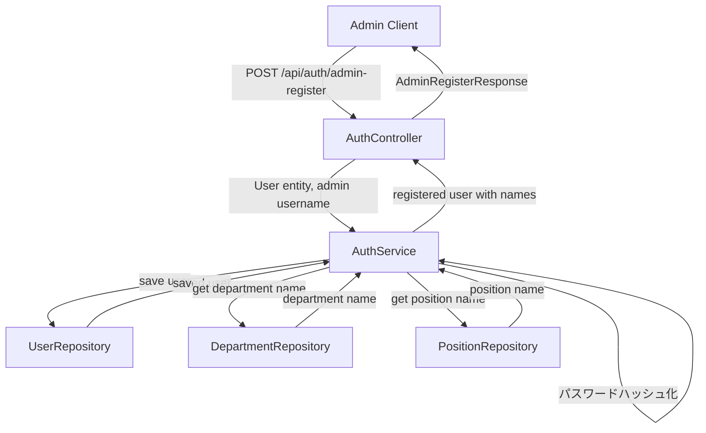
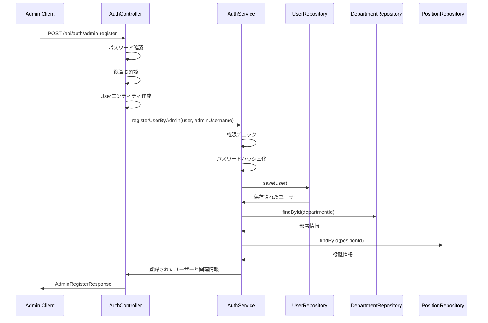

# 管理员注册用户流程说明书

このドキュメントでは、管理者によるユーザー登録フローと関連するクラス・メソッドについて説明します。

## 1. 概要

管理者登録ユーザー機能は、管理者が他のユーザーのアカウントを作成するための機能です。管理者は登録フォームに必要な情報を入力し、システムに送信することで他のユーザーのアカウントを作成します。

## 2. 登録フロー

### 2.1 クライアントからのリクエスト

管理者は以下のエンドポイントにPOSTリクエストを送信します：

```
POST /api/auth/admin-register
```

リクエストヘッダー：
```
X-Admin-Username: admin@example.com
```

リクエストボディの例：
```json
{
  "username": "newuser@example.com",
  "password": "password123",
  "confirmPassword": "password123",
  "fullName": "新規ユーザー",
  "locationType": "office",
  "clientLatitude": null,
  "clientLongitude": null,
  "departmentId": 1,
  "positionId": 3,
  "managerId": 2
}
```

### 2.2 エンドポイント処理

リクエストは[AuthController](file://f:\Company_system_project\company_backend\src\main\java\com\example\companybackend\controller\AuthController.java)の[registerAdminUser](file://f:\Company_system_project\company_backend\src\main\java\com\example\companybackend\controller\AuthController.java#L177-L248)メソッドで処理されます。

関連するクラスとメソッド：
- [AuthController.registerAdminUser()](file://f:\Company_system_project\company_backend\src\main\java\com\example\companybackend\controller\AuthController.java#L177-L248)
- [AdminRegisterRequest](file://f:\Company_system_project\company_backend\src\main\java\com\example\companybackend\dto\auth\AdminRegisterRequest.java) - リクエストDTO
- [AdminRegisterResponse](file://f:\Company_system_project\company_backend\src\main\java\com\example\companybackend\dto\auth\AdminRegisterResponse.java) - レスポンスDTO

### 2.3 権限確認

コントローラーは、リクエストユーザーが管理者権限を持っているかを確認します（Spring Securityによる自動確認）。

関連するクラスとメソッド：
- [SecurityConfig](file://f:\Company_system_project\company_backend\src\main\java\com\example\companybackend\config\SecurityConfig.java) - セキュリティ設定
- [@PreAuthorize](file://f:\Company_system_project\company_backend\src\main\java\com\example\companybackend\controller\AuthController.java#L177-L177) アノテーション

### 2.4 パスワード確認

コントローラーは、リクエスト内のパスワードと確認用パスワードが一致するかを確認します。

関連するクラスとメソッド：
- [AuthController.registerAdminUser()](file://f:\Company_system_project\company_backend\src\main\java\com\example\companybackend\controller\AuthController.java#L177-L248) - パスワード比較ロジック

### 2.5 役職ID確認

管理者はユーザーの役職を設定する必要があり、役職IDが有効かどうかを確認します。

関連するクラスとメソッド：
- [AuthController.registerAdminUser()](file://f:\Company_system_project\company_backend\src\main\java\com\example\companybackend\controller\AuthController.java#L177-L248) - 役職ID確認ロジック

### 2.6 ユーザーエンティティの作成

リクエストデータをもとに[User](file://f:\Company_system_project\company_backend\src\main\java\com\example\companybackend\entity\User.java)エンティティが作成されます。

関連するクラスとメソッド：
- [User](file://f:\Company_system_project\company_backend\src\main\java\com\example\companybackend\entity\User.java) - ユーザーエンティティ
- [AuthController.registerAdminUser()](file://f:\Company_system_project\company_backend\src\main\java\com\example\companybackend\controller\AuthController.java#L177-L248) - Userエンティティへのデータマッピング

### 2.7 サービス層の呼び出し

作成されたUserエンティティと管理者ユーザー名を引数として、[AuthService.registerUserByAdmin()](file://f:\Company_system_project\company_backend\src\main\java\com\example\companybackend\service\AuthService.java#L74-L98)メソッドが呼び出されます。

関連するクラスとメソッド：
- [AuthService](file://f:\Company_system_project\company_backend\src\main\java\com\example\companybackend\service\AuthService.java)
- [AuthService.registerUserByAdmin()](file://f:\Company_system_project\company_backend\src\main\java\com\example\companybackend\service\AuthService.java#L74-L98)

### 2.8 権限チェック

[AuthService.registerUserByAdmin()](file://f:\Company_system_project\company_backend\src\main\java\com\example\companybackend\service\AuthService.java#L74-L98)メソッド内で、管理者ユーザーがユーザー登録の権限を持っているかを確認します。

関連するクラスとメソッド：
- [AuthService.registerUserByAdmin()](file://f:\Company_system_project\company_backend\src\main\java\com\example\companybackend\service\AuthService.java#L74-L98) - 権限チェックロジック

### 2.9 パスワードのハッシュ化

[AuthService.registerUserByAdmin()](file://f:\Company_system_project\company_backend\src\main\java\com\example\companybackend\service\AuthService.java#L74-L98)メソッド内で、ユーザーのパスワードがハッシュ化されます。

関連するクラスとメソッド：
- [AuthService.registerUserByAdmin()](file://f:\Company_system_project\company_backend\src\main\java\com\example\companybackend\service\AuthService.java#L74-L98) - パスワードハッシュ化処理
- [User.setPasswordHash()](file://f:\Company_system_project\company_backend\src\main\java\com\example\companybackend\entity\User.java#L35-L35) - ハッシュ化されたパスワードの設定

### 2.10 ユーザーデータの保存

ハッシュ化されたパスワードを含むUserエンティティが、[UserRepository](file://f:\Company_system_project\company_backend\src\main\java\com\example\companybackend\repository\UserRepository.java)を介してデータベースに保存されます。

関連するクラスとメソッド：
- [UserRepository](file://f:\Company_system_project\company_backend\src\main\java\com\example\companybackend\repository\UserRepository.java)
- [UserRepository.save()](file://f:\Company_system_project\company_backend\src\main\java\com\example\companybackend\repository\UserRepository.java#L25-L25)

### 2.11 部署名と役職名の取得

登録されたユーザーの部署IDと役職IDから、それぞれの名前を取得します。

関連するクラスとメソッド：
- [AuthService.getDepartmentNameById()](file://f:\Company_system_project\company_backend\src\main\java\com\example\companybackend\service\AuthService.java#L162-L164)
- [AuthService.getPositionNameById()](file://f:\Company_system_project\company_backend\src\main\java\com\example\companybackend\service\AuthService.java#L166-L168)
- [DepartmentRepository](file://f:\Company_system_project\company_backend\src\main\java\com\example\companybackend\repository\DepartmentRepository.java)
- [PositionRepository](file://f:\Company_system_project\company_backend\src\main\java\com\example\companybackend\repository\PositionRepository.java)

### 2.12 レスポンスの生成

登録されたユーザー情報、部署名、役職名を含むレスポンスが生成されます。

関連するクラスとメソッド：
- [AdminRegisterResponse](file://f:\Company_system_project\company_backend\src\main\java\com\example\companybackend\dto\auth\AdminRegisterResponse.java)
- [AdminRegisterResponse.success()](file://f:\Company_system_project\company_backend\src\main\java\com\example\companybackend\dto\auth\AdminRegisterResponse.java#L39-L48)

### 2.13 クライアントへのレスポンス返却

成功した場合はHTTP 201 CREATEDステータスで、失敗した場合は適切なエラーステータスでレスポンスが返却されます。

## 3. クラス図



## 4. シーケンス図



## 5. エラーハンドリング

### 5.1 パスワード不一致

入力されたパスワードと確認用パスワードが一致しない場合、エラーレスポンスが返されます。

関連するクラスとメソッド：
- [AuthController.registerAdminUser()](file://f:\Company_system_project\company_backend\src\main\java\com\example\companybackend\controller\AuthController.java#L177-L248) - パスワード確認ロジック

### 5.2 役職ID無効

役職IDが無効な場合（nullまたは0以下）、エラーレスポンスが返されます。

関連するクラスとメソッド：
- [AuthController.registerAdminUser()](file://f:\Company_system_project\company_backend\src\main\java\com\example\companybackend\controller\AuthController.java#L177-L248) - 役職ID確認ロジック

### 5.3 権限不足

管理者ユーザーがユーザー登録の権限を持っていない場合、エラーレスポンスが返されます。

関連するクラスとメソッド：
- [AuthService.registerUserByAdmin()](file://f:\Company_system_project\company_backend\src\main\java\com\example\companybackend\service\AuthService.java#L74-L98) - 権限チェックロジック

### 5.4 データベースエラー

データベースへの保存中にエラーが発生した場合、エラーレスポンスが返されます。

関連するクラスとメソッド：
- [AuthController.registerAdminUser()](file://f:\Company_system_project\company_backend\src\main\java\com\example\companybackend\controller\AuthController.java#L177-L248) - 例外処理
- [AuthService.registerUserByAdmin()](file://f:\Company_system_project\company_backend\src\main\java\com\example\companybackend\service\AuthService.java#L74-L98) - データベース操作

## 6. セキュリティ対策

### 6.1 権限管理

管理者のみがこのエンドポイントにアクセスできるように、Spring Securityで保護されています。

関連するクラスとメソッド：
- [SecurityConfig](file://f:\Company_system_project\company_backend\src\main\java\com\example\companybackend\config\SecurityConfig.java) - セキュリティ設定
- [@PreAuthorize("hasRole('ADMIN')")](file://f:\Company_system_project\company_backend\src\main\java\com\example\companybackend\controller\AuthController.java#L177-L177) - 権限アノテーション

### 6.2 パスワードハッシュ化

平文パスワードはデータベースに保存されず、BCryptなどのハッシュアルゴリズムでハッシュ化されます。

関連するクラスとメソッド：
- [AuthService.registerUserByAdmin()](file://f:\Company_system_project\company_backend\src\main\java\com\example\companybackend\service\AuthService.java#L74-L98) - パスワードハッシュ化

### 6.3 入力バリデーション

リクエストデータは適切にバリデーションされ、不正なデータは拒否されます。

関連するクラスとメソッド：
- [AdminRegisterRequest](file://f:\Company_system_project\company_backend\src\main\java\com\example\companybackend\dto\auth\AdminRegisterRequest.java) - バリデーションアノテーション

## 7. ログ出力

各処理ステップで適切なログが出力され、トラブルシューティングに役立ちます。

関連するクラスとメソッド：
- [AuthController](file://f:\Company_system_project\company_backend\src\main\java\com\example\companybackend\controller\AuthController.java) - ログ出力