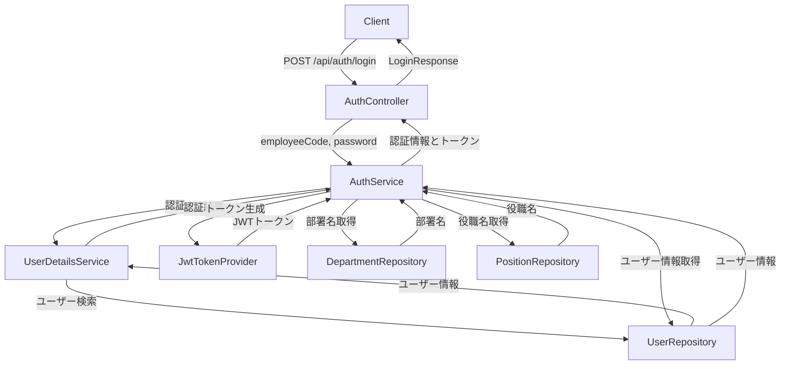
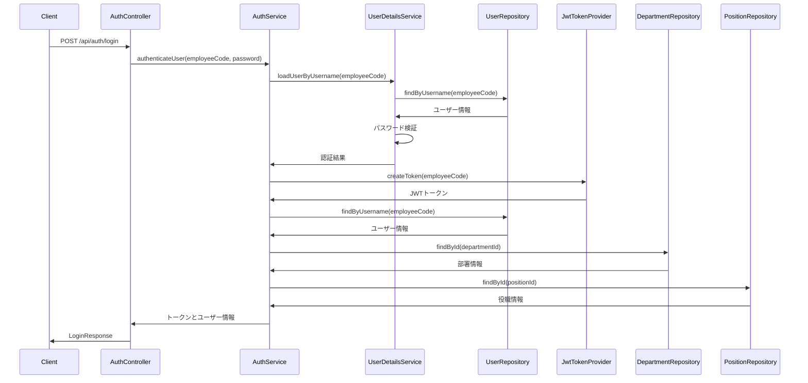

# 用户登录流程说明书

このドキュメントでは、ユーザーのログインフローと関連するクラス・メソッドについて説明します。

## 1. 概要

ユーザー ログイン機能は、既存のユーザーがシステムに認証してアクセスするための機能です。ユーザーはユーザー名（employeeCode）とパスワードを入力し、システムに送信することで認証を行います。

## 2. ログインフロー

### 2.1 クライアントからのリクエスト

ユーザーは以下のエンドポイントにPOSTリクエストを送信します：

```
POST /api/auth/login
```

リクエストボディの例：
```json
{
  "employeeCode": "user@example.com",
  "password": "password123"
}
```

### 2.2 エンドポイント処理

リクエストは[AuthController](file://f:\Company_system_project\company_backend\src\main\java\com\example\companybackend\controller\AuthController.java)の[loginUser](file://f:\Company_system_project\company_backend\src\main\java\com\example\companybackend\controller\AuthController.java#L94-L141)メソッドで処理されます。

関連するクラスとメソッド：
- [AuthController.loginUser()](file://f:\Company_system_project\company_backend\src\main\java\com\example\companybackend\controller\AuthController.java#L94-L141)
- [LoginRequest](file://f:\Company_system_project\company_backend\src\main\java\com\example\companybackend\dto\auth\LoginRequest.java) - リクエストDTO
- [LoginResponse](file://f:\Company_system_project\company_backend\src\main\java\com\example\companybackend\dto\auth\LoginResponse.java) - レスポンスDTO

### 2.3 認証処理

[AuthService.authenticateUser()](file://f:\Company_system_project\company_backend\src\main\java\com\example\companybackend\service\AuthService.java#L100-L123)メソッドが呼び出され、ユーザーの認証が行われます。

関連するクラスとメソッド：
- [AuthService](file://f:\Company_system_project\company_backend\src\main\java\com\example\companybackend\service\AuthService.java)
- [AuthService.authenticateUser()](file://f:\Company_system_project\company_backend\src\main\java\com\example\companybackend\service\AuthService.java#L100-L123)
- [UserDetailsService](file://f:\Company_system_project\company_backend\src\main\java\com\example\companybackend\service\UserDetailsServiceImpl.java) - ユーザー詳細サービス
- [UserRepository](file://f:\Company_system_project\company_backend\src\main\java\com\example\companybackend\repository\UserRepository.java) - ユーザーリポジトリ
- [UserRepository.findByUsername()](file://f:\Company_system_project\company_backend\src\main\java\com\example\companybackend\repository\UserRepository.java#L27-L27) - ユーザー検索

### 2.4 パスワード検証

入力されたパスワードがデータベースに保存されているハッシュ化されたパスワードと一致するかを検証します。

関連するクラスとメソッド：
- [BCryptPasswordEncoder](file://f:\Company_system_project\company_backend\src\main\java\com\example\companybackend\security\JwtTokenProvider.java#L27-L27) - パスワードエンコーダー
- [AuthService.authenticateUser()](file://f:\Company_system_project\company_backend\src\main\java\com\example\companybackend\service\AuthService.java#L100-L123) - 認証ロジック

### 2.5 JWTトークン生成

認証が成功した場合、JWTトークンが生成されます。

関連するクラスとメソッド：
- [JwtTokenProvider](file://f:\Company_system_project\company_backend\src\main\java\com\example\companybackend\security\JwtTokenProvider.java) - JWTトークンプロバイダー
- [JwtTokenProvider.createToken()](file://f:\Company_system_project\company_backend\src\main\java\com\example\companybackend\security\JwtTokenProvider.java#L35-L44) - トークン生成メソッド

### 2.6 ユーザー情報取得

認証されたユーザーの詳細情報を取得します。

関連するクラスとメソッド：
- [AuthService.getUserByUsername()](file://f:\Company_system_project\company_backend\src\main\java\com\example\companybackend\service\AuthService.java#L158-L160) - ユーザー情報取得
- [User](file://f:\Company_system_project\company_backend\src\main\java\com\example\companybackend\entity\User.java) - ユーザーエンティティ

### 2.7 部署名と役職名の取得

ユーザーの部署IDと役職IDから、それぞれの名前を取得します。

関連するクラスとメソッド：
- [AuthService.getDepartmentNameById()](file://f:\Company_system_project\company_backend\src\main\java\com\example\companybackend\service\AuthService.java#L162-L164)
- [AuthService.getPositionNameById()](file://f:\Company_system_project\company_backend\src\main\java\com\example\companybackend\service\AuthService.java#L166-L168)
- [DepartmentRepository](file://f:\Company_system_project\company_backend\src\main\java\com\example\companybackend\repository\DepartmentRepository.java)
- [PositionRepository](file://f:\Company_system_project\company_backend\src\main\java\com\example\companybackend\repository\PositionRepository.java)

### 2.8 レスポンスの生成

JWTトークン、ユーザー情報、部署名、役職名を含むレスポンスが生成されます。

関連するクラスとメソッド：
- [LoginResponse](file://f:\Company_system_project\company_backend\src\main\java\com\example\companybackend\dto\auth\LoginResponse.java)
- [LoginResponse.success()](file://f:\Company_system_project\company_backend\src\main\java\com\example\companybackend\dto\auth\LoginResponse.java#L44-L57)

### 2.9 クライアントへのレスポンス返却

成功した場合はHTTP 200 OKステータスで、認証に失敗した場合はHTTP 401 Unauthorizedステータスでレスポンスが返却されます。

## 3. クラス図



## 4. シーケンス図



## 5. エラーハンドリング

### 5.1 認証失敗

ユーザー名またはパスワードが正しくない場合、認証に失敗し、エラーレスポンスが返されます。

関連するクラスとメソッド：
- [AuthController.loginUser()](file://f:\Company_system_project\company_backend\src\main\java\com\example\companybackend\controller\AuthController.java#L94-L141) - 認証失敗処理
- [AuthService.authenticateUser()](file://f:\Company_system_project\company_backend\src\main\java\com\example\companybackend\service\AuthService.java#L100-L123) - 認証ロジック
- [UserDetailsServiceImpl.loadUserByUsername()](file://f:\Company_system_project\company_backend\src\main\java\com\example\companybackend\service\UserDetailsServiceImpl.java#L23-L37) - ユーザー詳細ロード

### 5.2 ユーザー存在しない

指定されたユーザー名のユーザーが存在しない場合、エラーレスポンスが返されます。

関連するクラスとメソッド：
- [UserDetailsServiceImpl.loadUserByUsername()](file://f:\Company_system_project\company_backend\src\main\java\com\example\companybackend\service\UserDetailsServiceImpl.java#L23-L37) - ユーザー検索

### 5.3 データベースエラー

データベースへのアクセス中にエラーが発生した場合、エラーレスポンスが返されます。

関連するクラスとメソッド：
- [AuthController.loginUser()](file://f:\Company_system_project\company_backend\src\main\java\com\example\companybackend\controller\AuthController.java#L94-L141) - 例外処理
- [AuthService.authenticateUser()](file://f:\Company_system_project\company_backend\src\main\java\com\example\companybackend\service\AuthService.java#L100-L123) - データベース操作

## 6. セキュリティ対策

### 6.1 パスワードハッシュ化

平文パスワードはデータベースに保存されず、BCryptなどのハッシュアルゴリズムでハッシュ化されます。

関連するクラスとメソッド：
- [BCryptPasswordEncoder](file://f:\Company_system_project\company_backend\src\main\java\com\example\companybackend\security\JwtTokenProvider.java#L27-L27) - パスワードエンコーダー

### 6.2 JWTトークン

認証成功後、JWTトークンが生成され、以降のリクエストで認証に使用されます。

関連するクラスとメソッド：
- [JwtTokenProvider](file://f:\Company_system_project\company_backend\src\main\java\com\example\companybackend\security\JwtTokenProvider.java) - JWTトークンプロバイダー

### 6.3 入力バリデーション

リクエストデータは適切にバリデーションされ、不正なデータは拒否されます。

関連するクラスとメソッド：
- [LoginRequest](file://f:\Company_system_project\company_backend\src\main\java\com\example\companybackend\dto\auth\LoginRequest.java) - バリデーションアノテーション

### 6.4 トークン有効期限

JWTトークンには有効期限が設定されており、期限切れのトークンは無効になります。

関連するクラスとメソッド：
- [JwtTokenProvider.createToken()](file://f:\Company_system_project\company_backend\src\main\java\com\example\companybackend\security\JwtTokenProvider.java#L35-L44) - トークン生成（有効期限設定）

## 7. ログ出力

各処理ステップで適切なログが出力され、トラブルシューティングに役立ちます。

関連するクラスとメソッド：
- [AuthController](file://f:\Company_system_project\company_backend\src\main\java\com\example\companybackend\controller\AuthController.java) - ログ出力
- [AuthService](file://f:\Company_system_project\company_backend\src\main\java\com\example\companybackend\service\AuthService.java) - 認証ログ出力