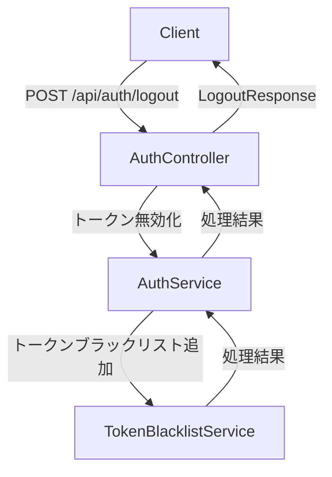
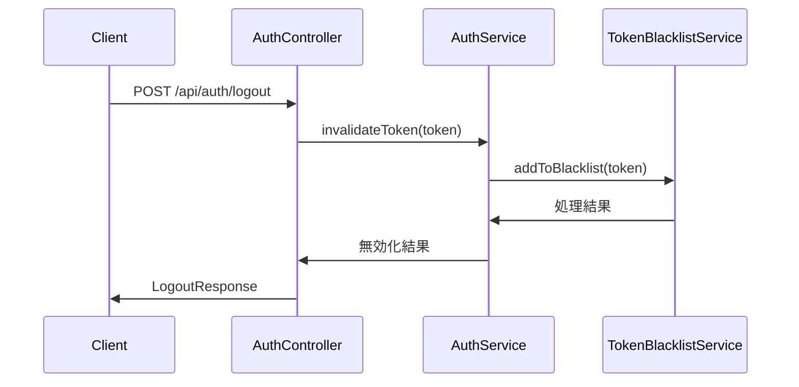

# 用户登出流程说明书

このドキュメントでは、ユーザーのログアウトフローと関連するクラス・メソッドについて説明します。

## 1. 概要

ユーザー ログアウト機能は、認証されたユーザーがシステムから安全にログアウトし、セッションを終了するための機能です。ユーザーは認証トークンを使用してログアウトリクエストを送信します。

## 2. ログアウトフロー

### 2.1 クライアントからのリクエスト

ユーザーは以下のエンドポイントにPOSTリクエストを送信します：

```
POST /api/auth/logout
```

リクエストヘッダー：
```
Authorization: Bearer <JWTトークン>
```

リクエストボディ：
```json
{}
```

### 2.2 エンドポイント処理

リクエストは[AuthController](file://f:\Company_system_project\company_backend\src\main\java\com\example\companybackend\controller\AuthController.java)の[logout](file://f:\Company_system_project\company_backend\src\main\java\com\example\companybackend\controller\AuthController.java#L159-L175)メソッドで処理されます。

関連するクラスとメソッド：
- [AuthController.logout()](file://f:\Company_system_project\company_backend\src\main\java\com\example\companybackend\controller\AuthController.java#L159-L175)
- [LogoutResponse](file://f:\Company_system_project\company_backend\src\main\java\com\example\companybackend\dto\auth\LogoutResponse.java) - レスポンスDTO

### 2.3 トークン無効化（TODO）

現在の実装ではトークン無効化処理は未実装ですが、将来的にはJWTトークンをブラックリストに追加するなどの処理が必要です。

関連するクラスとメソッド：
- [AuthService.invalidateToken()](file://f:\Company_system_project\company_backend\src\main\java\com\example\companybackend\service\AuthService.java) - トークン無効化（未実装）
- TokenBlacklistService - トークンブラックリスト管理サービス（未実装）

### 2.4 レスポンスの生成

ログアウト成功メッセージを含むレスポンスが生成されます。

関連するクラスとメソッド：
- [LogoutResponse](file://f:\Company_system_project\company_backend\src\main\java\com\example\companybackend\dto\auth\LogoutResponse.java)
- [LogoutResponse.success()](file://f:\Company_system_project\company_backend\src\main\java\com\example\companybackend\dto\auth\LogoutResponse.java#L21-L23)

### 2.5 クライアントへのレスポンス返却

成功した場合はHTTP 200 OKステータスでレスポンスが返却されます。

## 3. クラス図



## 4. シーケンス図



## 5. エラーハンドリング

### 5.1 トークン無効

提供されたトークンが無効な場合、エラーレスポンスが返されます。

関連するクラスとメソッド：
- [AuthController.logout()](file://f:\Company_system_project\company_backend\src\main\java\com\example\companybackend\controller\AuthController.java#L159-L175) - トークン検証

### 5.2 データベースエラー

トークン無効化処理中にデータベースエラーが発生した場合、エラーレスポンスが返されます。

関連するクラスとメソッド：
- [AuthController.logout()](file://f:\Company_system_project\company_backend\src\main\java\com\example\companybackend\controller\AuthController.java#L159-L175) - 例外処理

## 6. セキュリティ対策

### 6.1 認証必須

ログアウトエンドポイントには認証が必要です。未認証のユーザーはアクセスできません。

関連するクラスとメソッド：
- [SecurityConfig](file://f:\Company_system_project\company_backend\src\main\java\com\example\companybackend\config\SecurityConfig.java) - セキュリティ設定

### 6.2 トークン無効化

ログアウト後はトークンが無効化され、再利用できません（将来的な機能）。

関連するクラスとメソッド：
- TokenBlacklistService - トークンブラックリスト管理（未実装）

## 7. ログ出力

各処理ステップで適切なログが出力され、トラブルシューティングに役立ちます。

関連するクラスとメソッド：
- [AuthController](file://f:\Company_system_project\company_backend\src\main\java\com\example\companybackend\controller\AuthController.java) - ログ出力