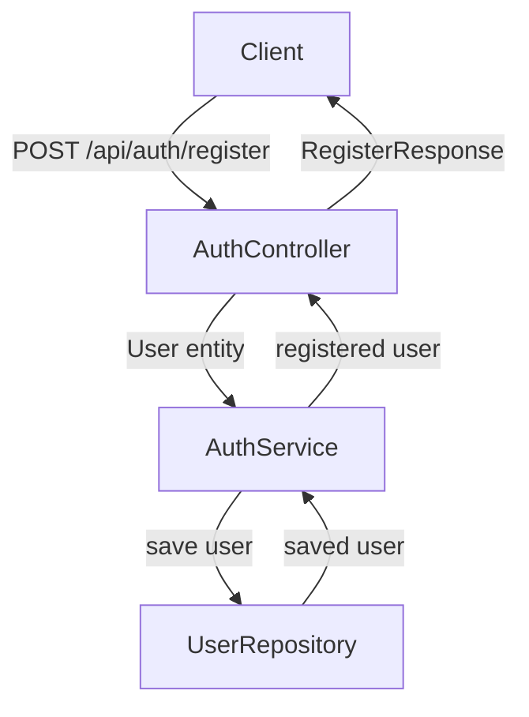
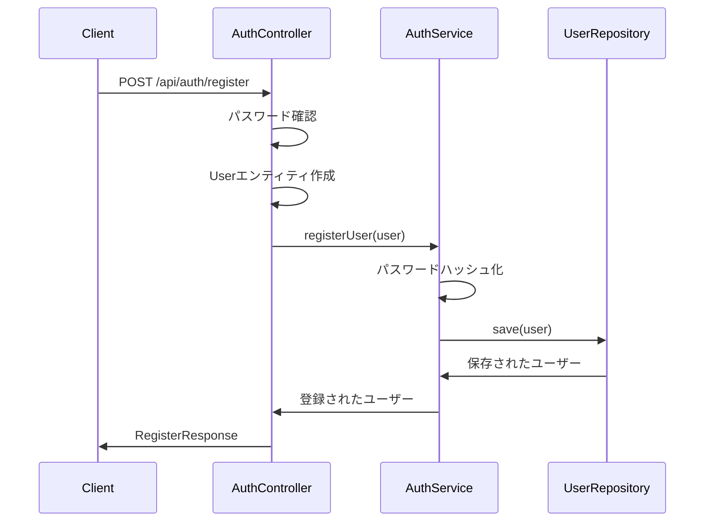

# 一般用户注册流程说明书

このドキュメントでは、一般ユーザーの登録フローと関連するクラス・メソッドについて説明します。

## 1. 概要

一般ユーザー登録は、ユーザーが自身のアカウントを作成するための機能です。ユーザーは登録フォームに必要な情報を入力し、システムに送信することでアカウントを作成します。

## 2. 登録フロー

### 2.1 クライアントからのリクエスト

ユーザーは以下のエンドポイントにPOSTリクエストを送信します：

```
POST /api/auth/register
```

リクエストボディの例：
```json
{
  "username": "user@example.com",
  "password": "password123",
  "confirmPassword": "password123",
  "fullName": "山田太郎",
  "locationType": "office",
  "clientLatitude": null,
  "clientLongitude": null,
  "departmentId": 1,
  "positionId": 3,
  "managerId": 2
}
```

### 2.2 エンドポイント処理

リクエストは[AuthController](file://f:\Company_system_project\company_backend\src\main\java\com\example\companybackend\controller\AuthController.java)の[registerUser](file://f:\Company_system_project\company_backend\src\main\java\com\example\companybackend\controller\AuthController.java#L44-L92)メソッドで処理されます。

関連するクラスとメソッド：
- [AuthController.registerUser()](file://f:\Company_system_project\company_backend\src\main\java\com\example\companybackend\controller\AuthController.java#L44-L92)
- [RegisterRequest](file://f:\Company_system_project\company_backend\src\main\java\com\example\companybackend\dto\auth\RegisterRequest.java) - リクエストDTO
- [RegisterResponse](file://f:\Company_system_project\company_backend\src\main\java\com\example\companybackend\dto\auth\RegisterResponse.java) - レスポンスDTO

### 2.3 パスワード確認

コントローラーは、リクエスト内のパスワードと確認用パスワードが一致するかを確認します。

関連するクラスとメソッド：
- [AuthController.registerUser()](file://f:\Company_system_project\company_backend\src\main\java\com\example\companybackend\controller\AuthController.java#L44-L92) - パスワード比較ロジック

### 2.4 ユーザーエンティティの作成

リクエストデータをもとに[User](file://f:\Company_system_project\company_backend\src\main\java\com\example\companybackend\entity\User.java)エンティティが作成されます。

関連するクラスとメソッド：
- [User](file://f:\Company_system_project\company_backend\src\main\java\com\example\companybackend\entity\User.java) - ユーザーエンティティ
- [AuthController.registerUser()](file://f:\Company_system_project\company_backend\src\main\java\com\example\companybackend\controller\AuthController.java#L44-L92) - Userエンティティへのデータマッピング

### 2.5 サービス層の呼び出し

作成されたUserエンティティを引数として、[AuthService.registerUser()](file://f:\Company_system_project\company_backend\src\main\java\com\example\companybackend\service\AuthService.java#L54-L72)メソッドが呼び出されます。

関連するクラスとメソッド：
- [AuthService](file://f:\Company_system_project\company_backend\src\main\java\com\example\companybackend\service\AuthService.java)
- [AuthService.registerUser()](file://f:\Company_system_project\company_backend\src\main\java\com\example\companybackend\service\AuthService.java#L54-L72)

### 2.6 パスワードのハッシュ化

[AuthService.registerUser()](file://f:\Company_system_project\company_backend\src\main\java\com\example\companybackend\service\AuthService.java#L54-L72)メソッド内で、ユーザーのパスワードがハッシュ化されます。

関連するクラスとメソッド：
- [AuthService.registerUser()](file://f:\Company_system_project\company_backend\src\main\java\com\example\companybackend\service\AuthService.java#L54-L72) - パスワードハッシュ化処理
- [User.setPasswordHash()](file://f:\Company_system_project\company_backend\src\main\java\com\example\companybackend\entity\User.java#L35-L35) - ハッシュ化されたパスワードの設定

### 2.7 ユーザーデータの保存

ハッシュ化されたパスワードを含むUserエンティティが、[UserRepository](file://f:\Company_system_project\company_backend\src\main\java\com\example\companybackend\repository\UserRepository.java)を介してデータベースに保存されます。

関連するクラスとメソッド：
- [UserRepository](file://f:\Company_system_project\company_backend\src\main\java\com\example\companybackend\repository\UserRepository.java)
- [UserRepository.save()](file://f:\Company_system_project\company_backend\src\main\java\com\example\companybackend\repository\UserRepository.java#L25-L25)

### 2.8 レスポンスの生成

登録されたユーザー情報を含むレスポンスが生成されます。

関連するクラスとメソッド：
- [RegisterResponse](file://f:\Company_system_project\company_backend\src\main\java\com\example\companybackend\dto\auth\RegisterResponse.java)
- [RegisterResponse.success()](file://f:\Company_system_project\company_backend\src\main\java\com\example\companybackend\dto\auth\RegisterResponse.java#L29-L42)

### 2.9 クライアントへのレスポンス返却

成功した場合はHTTP 201 CREATEDステータスで、失敗した場合は適切なエラーステータスでレスポンスが返却されます。

## 3. クラス図



## 4. シーケンス図



## 5. エラーハンドリング

### 5.1 パスワード不一致

入力されたパスワードと確認用パスワードが一致しない場合、エラーレスポンスが返されます。

関連するクラスとメソッド：
- [AuthController.registerUser()](file://f:\Company_system_project\company_backend\src\main\java\com\example\companybackend\controller\AuthController.java#L44-L92) - パスワード確認ロジック

### 5.2 データベースエラー

データベースへの保存中にエラーが発生した場合、エラーレスポンスが返されます。

関連するクラスとメソッド：
- [AuthController.registerUser()](file://f:\Company_system_project\company_backend\src\main\java\com\example\companybackend\controller\AuthController.java#L44-L92) - 例外処理
- [AuthService.registerUser()](file://f:\Company_system_project\company_backend\src\main\java\com\example\companybackend\service\AuthService.java#L54-L72) - データベース操作

## 6. セキュリティ対策

### 6.1 パスワードハッシュ化

平文パスワードはデータベースに保存されず、BCryptなどのハッシュアルゴリズムでハッシュ化されます。

関連するクラスとメソッド：
- [AuthService.registerUser()](file://f:\Company_system_project\company_backend\src\main\java\com\example\companybackend\service\AuthService.java#L54-L72) - パスワードハッシュ化

### 6.2 入力バリデーション

リクエストデータは適切にバリデーションされ、不正なデータは拒否されます。

関連するクラスとメソッド：
- [RegisterRequest](file://f:\Company_system_project\company_backend\src\main\java\com\example\companybackend\dto\auth\RegisterRequest.java) - バリデーションアノテーション

## 7. ログ出力

各処理ステップで適切なログが出力され、トラブルシューティングに役立ちます。

関連するクラスとメソッド：
- [AuthController](file://f:\Company_system_project\company_backend\src\main\java\com\example\companybackend\controller\AuthController.java) - ログ出力